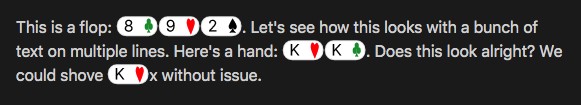

# Obsidian Poker

Plugin to render poker cards in Obsidian.

## Screenshot



## How to Install

In Obsidian go to `Settings > Third-party plugins > Community Plugins > Browse` and search for `Poker`.

### Manual installation

Unzip the [latest release](https://github.com/mAAdhaTTah/obsidian-poker/releases/latest) into your `<vault>/.obsidian/plugins/` folder.

## How to Configure

The plugin allows you to customize the prefix you use for inline cards. Go to `Settings -> Poker` to customize. The plugin defaults to `pkr` as the prefix.

## How to Use

### Rendering Cards

To render a card, add backticks your chosen prefix, and a colon, then write the card(s) in standard 2 letter notation (e.g. `As` for the ace of spades).

#### Example

```
This is a card: `pkr:As`.

You can also do multiple cards at once: `pkr:AsAc`.
```

## Roadmap

- Add support for card with no suit (e.g. `Kx`)
- Add support for unknown suited or offsuit cards or other cards (e.g. `KsXo`, `KsXs`, or `KsX`)
- Add command to generate a random number of cards (e.g. to generate a random flop)
- Add a hand replayer using markdown codeblocks & YAML to define a hand and show a replayer in preview to watch it
